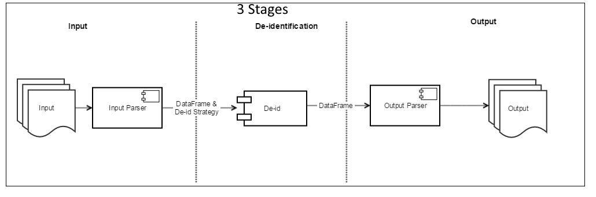

# Architecture:

The general approach is to stage the data into a Spark DataFrame, and then perform the de-identification on the DataFrame and produce a new DataFrame containing the de-identified data.
The primary de-identification components consist of several data transformation modules that could be used on the columns of the input DataFrame thru a custom configuration file to de-identify the columns using a particular schema, as specified thru the configuration file.
The driver routine essentially assembles 3 stages of the processing into an end-to-end Spark job.

## Stage 1:
The data in this stage is acquired from various kind of sources, e.g. HDFS, local file system files, JDBC database tables and read into a Spark DataFrame.

## Stage 2:
De-identification strategy for each data entity is built and specified through JSON configuration file. Any column that is not specified in the configuration file which is present in the original data entity gets dropped. This done for security purpose, lest we should expose any sensitive data outside inadvertently. 

## Stage 3: 
Process the original data applying the de-identification strategy developed in Stage 2. The processed de-identified data is then stored in Spark DataFrame structure which subsequently gets persisted into specific storage and format as specified through the run time parameters.

## The primary De-identification strategies

### Stage 1:
The data in this stage is acquired from various kind of sources, e.g. HDFS, local file system files, JDBC database tables and read into a Spark DataFrame.

### Stage 2:
De-identification strategy for each data entity is built and specified through JSON configuration file. Any column that is not specified in the configuration file which is present in the original data entity gets dropped. This done for security purpose, lest we should expose any sensitive data outside inadvertently. 

### Stage 3: 
Process the original data applying the de-identification strategy developed in Stage 2. The processed de-identified data is then stored in Spark DataFrame structure which subsequently gets persisted into specific storage and format as specified through the run time parameters.

## The primary De-identification strategies

### The most widely used strategies are:

**Hash:** It generates a 128 bit scrambled hash data for each individual column entry.  
**FixedFirstName:** Outputs the literal ‘FirstName’ for column entries. Specified for columns containing First Name in any data set.  
**FixedLastName:** Outputs the literal ‘LastName’ for column entries. Specified for columns containing Last Name in any data set.  
**oncoemrFirstName:** Outputs randomized first name for male and female names. Specified for columns containing First Name in any data set.  
**Zip3:** Outputs only the first 3 digits of the zip code in the data set. The remaining 2 digits are transformed to 0.  
**Year:** An arbitrary year is generated for the column value. Specified for data columns.  
**DateDay:** Used  on Date field with date format as YYYY-MM-DD. The day part is transformed to a numeric literal of 1.  
**DateTimeDay:** Used  on Date field with date & time part laid out as YYYY-MM-DD HH:MM:SS:sss. The day part is transformed to a numeric literal of 1.  
**Clear:** Clears the content of the column.  
**Identity:** The column value is generated as is. No change made to original data value.  
**Drop:** The column is dropped in the output data. The column would also be dropped if it is not specified in the configuration file.  

# Building the De-identification executable
Clone the the source code from repository:
        git clone https://<your-user-id>@stash.nantmobile.com/scm/deid/deidentification.git

# Build the package jar file

### Building the De-identification executable
Clone the the source code from repository:
        git clone https://<your-user-id>@stash.nantmobile.com/scm/deid/deidentification.git

### Build the package jar file
       mvn clean package
       zip -d target/DataImaging.jar 'META-INF/.SF' 'META-INF/.RSA' 'META-INF/*SF' 

# Deploying the package for execution
The built package could be uploaded to a desired location on the Cloudera Hadoop cluster using the Hue Web Interface. Use the ‘Upload’ option of the ‘File Browser’ menu item to do so.

It can be also be deployed by securely copying to a node on the cluster and then put in the desired location on the Hadoop cluster.

   a. scp target/DataImaging.jar <your-login>@c01nhvd627.nh.corp:/home/<your-login>
   b. hdfs dfs -put ./DataImaging.jar /some/location/here/in/hdfs

## System Considerations
The current application is built on Spark Version 1.6.0. The library provided by Cloudera has also patches ersions 1.6.1 and 1.6.2. This code should be backward compatible for higher versions of Cloudera. The application could be run on a local environment with local Spark and Hadoop installations.

## Executing the De-identification tool
The main processing component of this tool is the Spark distributed data processing engine. It could be run in client mode or cluster mode. And, on rare occasions would run in local mode.
In the production environment this would run in cluster mode. When testing a data set for de-identification in development, this should be executed in client mode.

### Example scenarios of De-identifying data
In the Development environment in Cloudera Hadoop HDFS we have 3 data files named ‘demographics.csv’, ‘encounters.csv’ and ‘heartrate_ts.csv’. They are at location /user/droy/GeneratedData.
These 3 data files are de-identified and persisted at another location within the HDFS data lake. In this example it is /user/droy/Deidentified.
The java jar file that contains the De-identifying application driver is DataImaging.jar.

The data files contains these data elements:

#### Demographics
  patient_id  
  first_name,  
  last_name,  
  dob,  
  gender,  
  race,  
  zip  

#### Encounters
  patient_id,  
  physician_id,  
  location_id,  
  visit_type,  
  encounter_date,  
  notes  

#### Heartrate_ts
  patient_id,  
  timestamp,  
  heartrate  

Configuration file for De-identifying strategy
The JSON file containing the De-identification strategy 
{
  "demographics": {  
    "patient_id": { "strategy": [ { "type": "Hash", "salt_key": "patient_key"}]},  
    "first_name": { "strategy": [ { "type": "FixedFirstName"}]},  
    "last_name": { "strategy": [ { "type": "FixedLastName"}]},  
    "dob": { "strategy": [ { "type": "Year"}]},  
    "gender": { "strategy": [ { "type": "Identity"}]},  
    "race": { "strategy": [ { "type": "Identity"}]},  
    "zip": { "strategy": [ { "type": "Zip3Digit"}]}  
  },  
  "encounters": {  
    "patient_id": { "strategy": [ { "type": "Hash", "salt_key": "patient_key"}]},  
    "physician_id": { "strategy": [ { "type": "Hash", "salt_key": "other_key"}]},  
    "location_id": { "strategy": [ { "type": "Hash", "salt_key": "loc_key"}]},  
    "visit_type": { "strategy": [ { "type": "Identity"}]},  
    "encounter_date": { "strategy": [ { "type": "Year"}]},  
    "notes": { "strategy": [ { "type": "Identity"}]}  
  },  
  "heartrate_ts": {  
    "patient_id": { "strategy": [ { "type": "Hash", "salt_key": "patient_key"}]},  
    "timestamp": { "strategy": [ { "type": "Year"}]},  
    "heartrate": { "strategy": [ { "type": "Identity"}]}  
  }  
}  

# Execution of the De-identification Driver
## To submit the Spark job :

### Scenario: Read from HDFS and output to HDFS

spark-submit \  
   --class net.navinet.research.spark.dlake.Driver \  
   --master yarn-client \  
   --driver-memory 4g \  
   --executor-memory 2g \  
   ./DataImaging.jar \  
   "input=hdfs://nameservice1/user/droy/GeneratedData" \  
   "output=hdfs://nameservice1/user/droy/Deidentified" \  
   "schema=/home/droy/deidentification/dlake-schema.json"  

The jar file is in the directory where the job is being executed from. The jar file could be accessed from a HDFS location as well.
For example could be specified as – hdfs:/user/droy/DataImaging.jar
The parameters used in this job submission are:
input: speicifies the location of the raw files to be de-identified.
output: specifies the location of the de-identified files to be kept.
schema: specifies the location of the de-identification strategy configuration file.

### Scenario: Read from HDFS and output as relational tables

spark-submit \  
   --class net.navinet.research.spark.dlake.Driver \  
   --master yarn-client \  
   --driver-memory 4g \  
   --executor-memory 2g \  
   ./DataImaging.jar \  
   "realm_type=hdfs" \  
   "input=hdfs://nameservice1/user/droy/StormData" \  
   "db_schema=droy" \  
   "schema=/home/droy/deidentification/storm-schema.json"  

The parameters used in this job submission are:
A new parameter type ‘realm_type’ is used here. This denotes which storage type the data is being read from. The possible values are : ‘hdfs’, ‘jdbc’ and ‘local’. The default value is ‘hdfs’  if the parameter is not specified.
The parameter ‘output’ is replaced with ‘db_schema’ in this scenario. The de-identified tables are now persisted as tables. In this case into a Hive database called ‘droy’. The tables could be accessed through Hive or Impala.
There is another value that could be used for 'realm_type' is 'jdbc-local'. This is used on rare occassions. In this scenario the spark process runs in 'local' mode using resources from a single server.
  
### Scenario: Read from local file system and output to local filesystem. 

This option could be used if there are data files in one of the nodes in the local files system. The de-identified data files are persisted on another location on the file system. 
With this option only a single Spark node is used in the processing of the data. This option should be used sparingly with small size of data.
  
spark-submit \
   --class net.navinet.research.spark.dlake.Driver \  
   --master yarn-client \  
   --driver-memory 4g \  
   --executor-memory 2g \  
   ./DataImaging.jar \  
   "realm_type=local" \  
   "input=/home/droy/deidentification/GeneratedData" \  
   "output=/home/droy/deidentification/Deidentified" \  
   "schema=/home/droy/deidentification/dlake-schema.json"  
  
The parameters ‘input’ and ‘output’ specifies locations on the machine on the local file system.
  
### Scenario: Read from HDFS and output as relational tables in a JDBC database.

spark-submit \  
   --class net.navinet.research.spark.dlake.Driver \  
   --master yarn-client \  
   --driver-memory 4g \  
   --executor-memory 2g \  
   ./DataImaging.jar \  
   "realm_type=hdfs" \  
   "input=hdfs://nameservice1/user/droy/StormData" \  
   "jdbc_output=/home/droy/deidentification/jdbc_out.prop" \  
   "schema=/home/droy/deidentification/storm-schema.json"
  
The parameter ‘jdbc_output’ specifies the location of the JDBC connectivity properties for the output database.
The jdbc_out.prop file in this example has the following properties:

url=jdbc:postgresql://10.7.188.32:5432/postgres
user=myuser
password=mypasswd
schema=deid
driver=org.postgresql.Driver

url - The jdbc url to be used for connecting to the database
user - To connect as user
password - Password of the user to connect as
schema - The schema for the de-identified tables to persisted in
driver – The jdbc driver to be used

### Scenario: Read from JDBC database and output as relational tables in a JDBC database.

spark-submit \
   --class net.navinet.research.spark.dlake.Driver \
   --master yarn-client \
   --driver-memory 4g \
   --executor-memory 2g \
   ./DataImaging.jar \
   "realm_type=jdbc" \
   "jdbc_input=/home/droy/deidentification/jdbc_in.prop" \
   "jdbc_output=/home/droy/deidentification/jdbc_out.prop" \
   "schema=/home/droy/deidentification/ohdsi-schema.json"
  
The parameter **realm_type** has the value **jdbc** and the parameter **jdbc_input** has the location of the input JDBC database properties file.
The jdbc_in.prop file has the following properties:
url=jdbc:postgresql://10.7.188.32:5432/postgres
user=myuser
password=mypasswd
schema=ohdsi
driver=org.postgresql.Driver
table=cohort,concept_set,cohort_generation_info

The property ‘schema’ specifies the read schema from where the tables would be read into. The ‘table’ property specifies the list of tables to be read for de-identification separated by comma.

